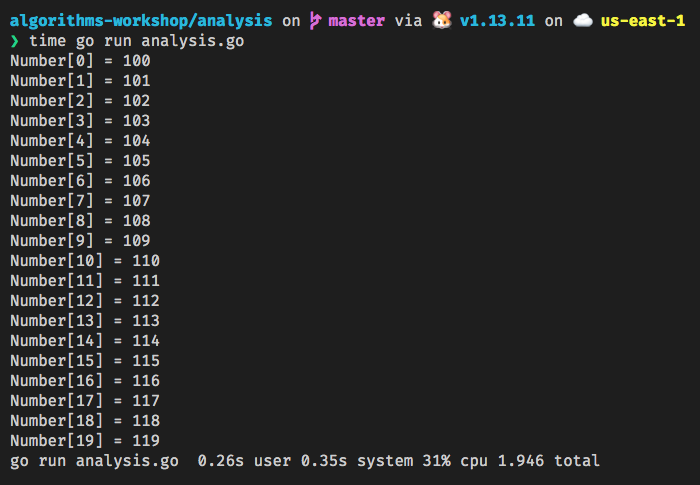
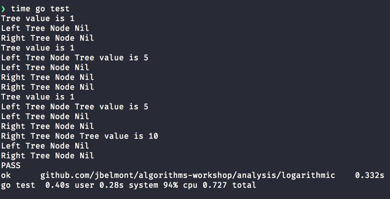

# Algorithms Workshop - Analysis of Algorithms

## Cost Model

Cost Models rely on analysis of the actual execution time and the time required to perform an individual step.

## Orders of Growth 

An algorithm is said to show a growth rate on the order of a mathematical functon and can be constrained with an upper bound as we saw in the Big-O section of the workshop.

## Cost Analysis 1

*Sample Code:*

```go
package main

import (
	"fmt"
)

func main() {
	var number [20]int

	for n := 0; n < 20; n++ {
		number[n] = n + 100
		fmt.Printf("Number[%d] = %d\n", n, number[n])
	}
}
```



Notice in my laptop which is a MacBook 2015 with 2.2 GHz Intel Core i7 processor this program took 0.15s user seconds

The computational time taken here is 20 * t and *t* is the time that it takes to add 2 integers and then update an array.

The *t* value here will vary depending on the computer hardware.

#### Analysis of program

\\( T(n) \\; = \\; \mathcal{O}(f(n)) \\; \rightarrow  Linear Time Complexity \\)

## Cost Analysis 2

*Sample Code:*

```go
func quadraticComplexity(iteration int) int {
	var computation int
	for i := 1; i <= iteration; i++ {
		for j := 1; j <= iteration; j++ {
			computation = i * j
			fmt.Println(computation)
		}
	}
	return computation
}
```

```sh
time go test
........................
100
PASS
ok  	github.com/jbelmont/algorithms-workshop/analysis/quadratic	0.253s
go test  0.38s user 0.28s system 100% cpu 0.655 total
```

#### Analysis of program

\\( T(n) \\; = \mathcal{O}({n^2}) \\; \rightarrow Quadratic \\; Time \\; Complexity \\)

## Cost Analysis 3

*Sample Code:*

```go
func cubicComplexity() int {
	const iteration = 10
	var threeDArr [iteration][iteration][iteration]int
	var compute int
	for i := 0; i < iteration; i++ {
		for j := 0; j < iteration; j++ {
			for k := 0; k < iteration; k++ {
				compute = (i + j) * k
				threeDArr[i][j][k] = compute
				fmt.Printf("Value in threeDArr[i][j][k] = %d\n", threeDArr[i][j][k])
			}
		}
	}
	return compute
}
```

```sh
time go test
.............................................
Value in threeDArr[i][j][k] = 162
PASS
ok      github.com/jbelmont/algorithms-workshop/analysis/cubic  0.288s
go test  0.38s user 0.24s system 101% cpu 0.601 total
```

#### Analysis of program

\\( T(n) \\; = \mathcal{O}({n^3}) \\; \rightarrow \\; Cubic  \\)

## Cost Analysis 4

*Sample Code:*

```go
package logarithmic

import "fmt"

type Tree struct {
	LNode *Tree
	Val   int
	RNode *Tree
}

func (t *Tree) insert(val int) {
	if t != nil {
		if t.LNode == nil {
			t.LNode = &Tree{
				nil, val, nil,
			}
		} else if t != nil && t.RNode == nil {
			t.RNode = &Tree{
				nil, val, nil,
			}
		} else {
			if t.LNode != nil {
				t.LNode.insert(val)
			} else {
				t.RNode.insert(val)
			}
		}
	} else {
		t = &Tree{
			nil, val, nil,
		}
	}
}

func printTree(t *Tree) {
	if t != nil {
		fmt.Printf("Tree value is %v\n", t.Val)
		fmt.Printf("Left Tree Node ")
		printTree(t.LNode)
		fmt.Printf("Right Tree Node ")
		printTree(t.RNode)
	} else {
		fmt.Printf("Nil\n")
	}
}
```



#### Analysis of program

\\( T(n) \\; = \mathcal{O}(log \\; n) \\; \rightarrow \\; Logarithmic  \\)

*An algorithms has a logarithmic complexity if the time it takes to process it is proportional to the logarithm of its inputs.*

*The logarithm base is usually in base 2.*

*The tree we used here is a binary tree with a Left Node and a Right Node.*

*The insert method is of \\( \mathcal{O}(log \\; n) \\) where n i sthe number of nodes.*