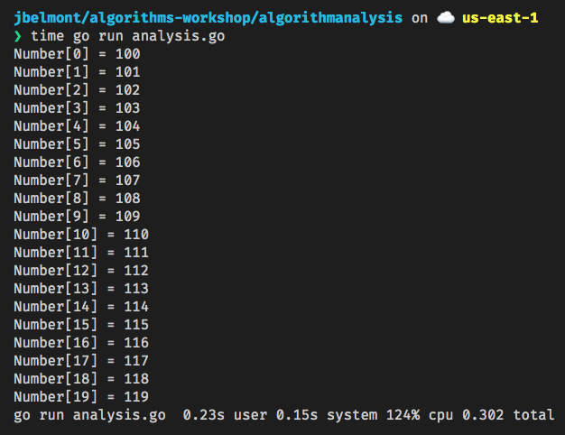

# Algorithms Workshop - Analysis of Algorithms

## Cost Model

Cost Models rely on analysis of the actual execution time and the time required to perform an individual step.

## Orders of Growth 

An algorithm is said to show a growth rate on the order of a mathematical functon and can be constrained with an upper bound as we saw in the Big-O section of the workshop.

## Example Cost Analysis

Sample Code:

```go
package algorithmanalysis

import (
	"fmt"
)

func main() {
	var number [20]int

	for n := 0; n < 20; n++ {
		number[n] = n + 100
		fmt.Printf("Number[%d] = %d\n", n, number[n])
	}
}
```



Notice in my laptop which is a MacBook 2015 with 2.2 GHz Intel Core i7 processor this program took 0.15s user seconds