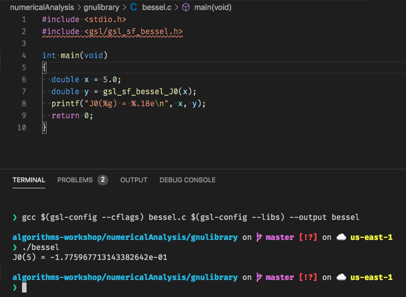

# Algorithms Workshop - Numerical Analysis

## Numerical Analysis Definition

> Numerical analysis is the study of algorithms that use numerical approximation (as opposed to symbolic manipulations) for the problems of mathematical analysis (as distinguished from discrete mathematics). Numerical analysis naturally finds application in all fields of engineering and the physical sciences, but in the 21st century also the life sciences, social sciences, medicine, business and even the arts have adopted elements of scientific computations. The growth in computing power has revolutionized the use of realistic mathematical models in science and engineering, and subtle numerical analysis is required to implement these detailed models of the world. For example, ordinary differential equations appear in celestial mechanics (predicting the motions of planets, stars and galaxies); numerical linear algebra is important for data analysis; stochastic differential equations and Markov chains are essential in simulating living cells for medicine and biology.

## Numerical Analysis Topics

[List of Numerical Analysis Topics via Wikipedia](https://en.wikipedia.org/wiki/List_of_numerical_analysis_topics)

## Netlib

> Netlib is a repository of software for scientific computing maintained by AT&T, Bell Laboratories, the University of Tennessee and Oak Ridge National Laboratory. Netlib comprises many separate programs and libraries. Most of the code is written in C and Fortran, with some programs in other languages.

[Netlib](https://en.wikipedia.org/wiki/Netlib)

## GNU Scientific Library

[GNU Scientific Library](https://en.wikipedia.org/wiki/GNU_Scientific_Library)

> The GNU Scientific Library (or GSL) is a software library for numerical computations in applied mathematics and science. The GSL is written in C; wrappers are available for other programming languages. The GSL is part of the GNU Project and is distributed under the GNU General Public License.

#### Install GNU Scientific Library Mac OS X

```bash
brew install gsl
```

#### Bessel Function Code

```c
#include <stdio.h>
#include <gsl/gsl_sf_bessel.h>

int main(void)
{
  double x = 5.0;
  double y = gsl_sf_bessel_J0(x);
  printf("J0(%g) = %.18e\n", x, y);
  return 0;
}
```

###### gcc compilation with library



#### Computing Platforms

* [MatLab](https://en.wikipedia.org/wiki/MATLAB)
* [GNU Octave](https://en.wikipedia.org/wiki/GNU_Octave)
* [Wolfram Mathematica](https://en.wikipedia.org/wiki/Wolfram_Mathematica)