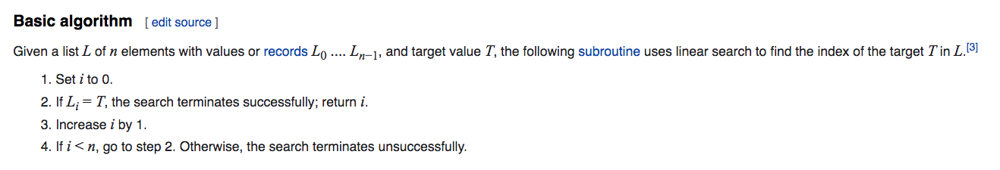

# Algorithms Workshop - Search Algorithms

## Search Algorithm Definition

[Search Algorithm (Wikipedia Definition)](https://en.wikipedia.org/wiki/Search_algorithm)

> In computer science, a search algorithm is any algorithm which solves the search problem, namely, to retrieve information stored within some data structure, or calculated in the search space of a problem domain, either with discrete or continuous values. Specific applications of search algorithms include:

> Problems in combinatorial optimization, such as:
>    * The vehicle routing problem, a form of shortest path problem
>    * The knapsack problem: Given a set of items, each with a weight and a value, determine the number of each item to include in a collection so that the total weight is less than or equal to a given limit and the total value is as large as possible.
>    * The nurse scheduling problem
>    * Problems in constraint satisfaction, such as:
>    * The map coloring problem
>    * Filling in a sudoku or crossword puzzle
>    * In game theory and especially combinatorial game theory, choosing the best move to make next
>    * Finding a combination or password from the whole set of possibilities
>    * Factoring an integer (an important problem in cryptography)
>    * Optimizing an industrial process, such as a chemical reaction, by changing the parameters of the process
>    * Retrieving a record from a database
>    * Finding the maximum or minimum value in a list or array
>    * Checking to see if a given value is present in a set of values

## Linear Search Algorithm

[Linear Search (Wikipedia Definition)](https://en.wikipedia.org/wiki/Linear_search)

> In computer science, a linear search or sequential search is a method for finding an element within a list. It sequentially checks each element of the list until a match is found or the whole list has been searched.

#### Linear Search Basic Algorithm

[Basic Algorithm](https://en.wikipedia.org/wiki/Linear_search#Basic_algorithm)



#### Linear Search Implementation

```go
package linearsearch

func search(elements []int, searchElem int) int {
	for index, element := range elements {
		if element == searchElem {
			return index
		}
	}
	return -1
}
```

#### Linear Search Test

[Linear Search Test](https://github.com/jbelmont/algorithms-workshop/blob/master/searchingAlgorithms/linearsearch/linearsearch_test.go)

## Binary Search Algorithm

> In computer science, binary search, also known as half-interval search, logarithmic search,or binary chop, is a search algorithm that finds the position of a target value within a sorted array. Binary search compares the target value to the middle element of the array. If they are not equal, the half in which the target cannot lie is eliminated and the search continues on the remaining half, again taking the middle element to compare to the target value, and repeating this until the target value is found. If the search ends with the remaining half being empty, the target is not in the array.

#### Binary Search Leftmost Element Pseudocode

[Leftmost Element Pseudocode](https://en.wikipedia.org/wiki/Binary_search_algorithm#Procedure_for_finding_the_leftmost_element)

```
function binary_search_leftmost(A, n, T):
    L := 0
    R := n
    while L < R:
        m := floor((L + R) / 2)
        if A[m] < T:
            L := m + 1
        else:
            R := m
    return L
```

#### Go standard library implementation

The [sort.Search](https://pkg.go.dev/sort#Search) implements the leftmost element procedure for the Binary Search Algorithm:

```go
// Search uses binary search to find and return the smallest index i
// in [0, n) at which f(i) is true, assuming that on the range [0, n),
// f(i) == true implies f(i+1) == true. That is, Search requires that
// f is false for some (possibly empty) prefix of the input range [0, n)
// and then true for the (possibly empty) remainder; Search returns
// the first true index. If there is no such index, Search returns n.
// (Note that the "not found" return value is not -1 as in, for instance,
// strings.Index.)
// Search calls f(i) only for i in the range [0, n).
//
// A common use of Search is to find the index i for a value x in
// a sorted, indexable data structure such as an array or slice.
// In this case, the argument f, typically a closure, captures the value
// to be searched for, and how the data structure is indexed and
// ordered.
//
// For instance, given a slice data sorted in ascending order,
// the call Search(len(data), func(i int) bool { return data[i] >= 23 })
// returns the smallest index i such that data[i] >= 23. If the caller
// wants to find whether 23 is in the slice, it must test data[i] == 23
// separately.
//
// Searching data sorted in descending order would use the <=
// operator instead of the >= operator.
//
// To complete the example above, the following code tries to find the value
// x in an integer slice data sorted in ascending order:
//
//	x := 23
//	i := sort.Search(len(data), func(i int) bool { return data[i] >= x })
//	if i < len(data) && data[i] == x {
//		// x is present at data[i]
//	} else {
//		// x is not present in data,
//		// but i is the index where it would be inserted.
//	}
//
// As a more whimsical example, this program guesses your number:
//
//	func GuessingGame() {
//		var s string
//		fmt.Printf("Pick an integer from 0 to 100.\n")
//		answer := sort.Search(100, func(i int) bool {
//			fmt.Printf("Is your number <= %d? ", i)
//			fmt.Scanf("%s", &s)
//			return s != "" && s[0] == 'y'
//		})
//		fmt.Printf("Your number is %d.\n", answer)
//	}
//
func Search(n int, f func(int) bool) int {
	// Define f(-1) == false and f(n) == true.
	// Invariant: f(i-1) == false, f(j) == true.
	i, j := 0, n
	for i < j {
		h := int(uint(i+j) >> 1) // avoid overflow when computing h
		// i ≤ h < j
		if !f(h) {
			i = h + 1 // preserves f(i-1) == false
		} else {
			j = h // preserves f(j) == true
		}
	}
	// i == j, f(i-1) == false, and f(j) (= f(i)) == true  =>  answer is i.
	return i
}
```

#### Binary Search Test

[Binary Search Test](https://github.com/jbelmont/algorithms-workshop/blob/master/searchingAlgorithms/binarysearch/binary_test.go)